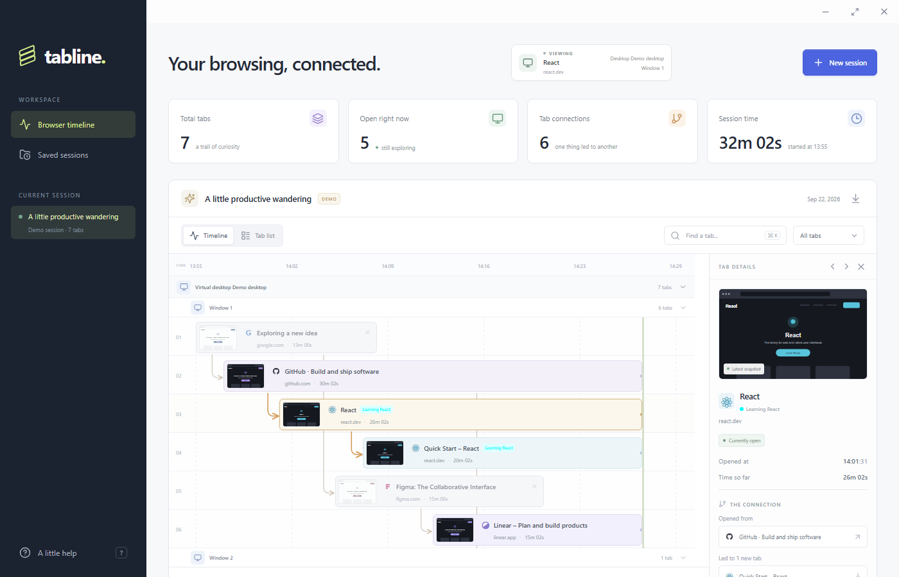
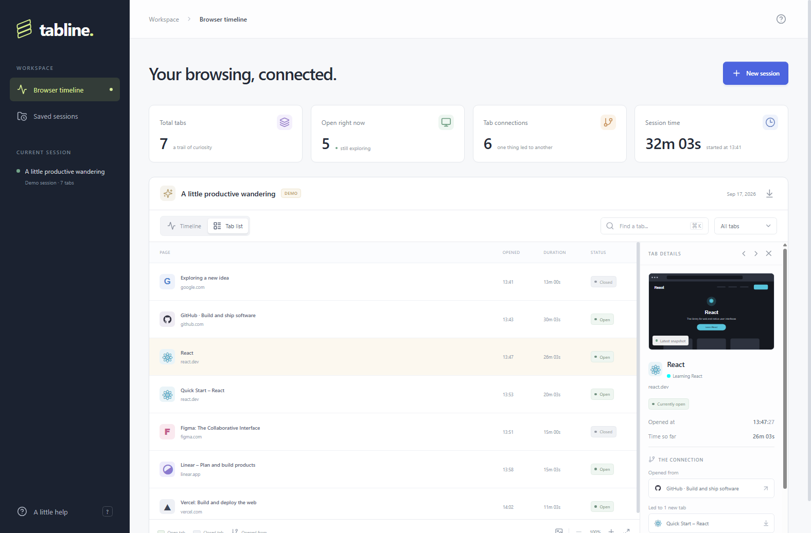

# Tabline

A local-first Electron app that turns your Helium or Chrome browsing session into a visual timeline. See when every tab opened and closed, preview its thumbnail, and follow arrows back to the tab that opened it.

See [GitHub Releases](https://github.com/Imam-f/tabline/releases) for downloads and the changelog.

## Screenshots

The timeline connects each tab to the tab that opened it, with thumbnails and a details panel.



The tab list view is a compact table of pages, open time, duration, and status.



## Run

Requires **Node.js 22+** and a local installation of **Helium** or **Google Chrome** (Chromium also works with a custom executable path).

```sh
npm install
npm run dev
```

Click **New session**, choose a browser, and launch it. Common installation locations are detected automatically. For a portable installation, AppImage, or a browser installed elsewhere, expand **Browser executable** and select or paste the executable path. On macOS, use the binary inside the application bundle, for example `/Applications/Helium.app/Contents/MacOS/Helium`.

To run the built app:

```sh
npm run build
npm start
```

To build a distributable for your operating system:

```sh
npm run dist
```

Installers are placed in `release/`. `npm run dist:dir` creates an unpacked desktop build using the locally installed Electron runtime. On Windows, open `release/win-unpacked/Tabline.exe` (keep the whole folder together). Signing credentials are needed if you want to distribute signed builds.

## What it does

- **Browser launcher** — Helium by default, with Chrome as an option and a custom executable picker. If only Chrome is installed, it is preselected.
- **Live timeline** — one lane per tab, with its opening time, lifetime, and closing time. Zoom, search, and filter open, closed, or connected tabs.
- **Opener arrows** — connect a new tab to its parent using Chromium’s `TargetInfo.openerId`.
- **Window grouping** — resolve each tab to its Chromium browser window with `Browser.getWindowForTarget`. Both timeline and list views have independently collapsible virtual-desktop and window sections. On Windows, Tabline also maps each window to its native virtual desktop, including desktops that are not currently visible. Other platforms label virtual-desktop membership as unavailable.
- **Window move history** — browser-window membership is polled independently every second, rather than only when a tab navigates or becomes active. Each detected move is timestamped in `windowHistory` and shown in the tab details panel.
- **Tab groups** — the managed browser loads the bundled Tabline companion extension, which reports Chromium tab-group membership, group title, color, collapsed state, and changes over a localhost-only bridge. Group updates are recorded independently of page navigation.
- **Tab order and restore** — track each tab's strip position, pinned and active state, and restore the tabs that were open when a saved session ended. To restore an earlier point, open the saved session, drag the timeline's time marker (or focus it and use the left/right arrow keys), then click **Restore from here**. The companion recreates windows, ordering, opener links, pinning, and groups when available; a CDP fallback still restores validated web URLs and windows when Chrome blocks the extension. On Windows, recreated windows are moved back to their saved virtual desktop when that desktop still exists.
- **Thumbnails** — real JPEG snapshots after page changes and approximately every 60 seconds. Select a tab to view a larger preview or refresh it manually.
- **Tab details** — page history, parent and child tabs, duration, and buttons to focus or close an open browser tab.
- **Tab freezer** — the Tabline companion extension can turn an individual tab into a persistent local short URL backed by its latest screenshot. Tabs inactive for five minutes get a preserved screenshot; after ten minutes they move to the snapshot page. The snapshot page has a floating return button, and the app's tab details panel also provides **Freeze tab** and **Return to original page** controls for live tabs. The extension can whitelist the current tab; its **Freeze all tabs** action freezes other tabs across all browser windows and virtual desktops, leaving the current tab and whitelisted pages untouched. Extension UI pages are excluded from the timeline.
- **Saved sessions** — automatically persist timelines, navigation history, and thumbnails locally. Click a saved session to select it, double-click to open it, or drag it to reorder. Organize sessions into folders, rename or delete them, and export an opened session as portable JSON.
- **Demo mode** — explore an example timeline without launching a browser. The standalone web preview (`npm run dev:web`) uses the demo; browser launching requires Electron.

## How it works

The Electron main process starts the selected Chromium-based browser with:

```text
--remote-debugging-port=0
--remote-debugging-address=127.0.0.1
--user-data-dir=<Tabline app data>/browser-data/profiles/<browser>
```

It reads the browser’s `DevToolsActivePort` file, connects to its local DevTools WebSocket, and subscribes to `Target` discovery events. Screenshots use short-lived flattened target sessions and `Page.captureScreenshot`. The companion extension is loaded only into Tabline’s dedicated browser profile because Chromium’s DevTools Protocol has no tab-group API.

Google Chrome builds can reject the `--load-extension` flag for security reasons. When that happens, window/timeline tracking still works, but Chrome will not provide native tab-group metadata. Use Helium or a Chromium build that permits unpacked extensions for automatic group colors, or manually load `electron/tabline-extension/` into the managed profile from `chrome://extensions` with Developer mode enabled. If the browser does not expose a stable target ID, Tabline ignores ambiguous duplicate-URL matches rather than assigning a group to the wrong tab. Fallback colors are deterministic by group ID, not the browser’s native color.

Tabline uses a dedicated, persistent browser profile per browser. This is required by current Chrome remote-debugging restrictions and keeps the tracked browser separate from your normal profile. Bookmarks, logins, and browser state within this profile persist between sessions. Only one tracked browser session runs at a time. Ending the session (or quitting the desktop app) closes the managed browser and saves its timeline.

The renderer is sandboxed with context isolation, no Node integration, a restrictive Content Security Policy, and a small preload IPC bridge. Debugging binds to localhost with an automatically assigned port. The app uses local fonts and does not send timeline data to a service.

### Details worth knowing

- Arrows are shown when the browser reports an opener. Tabs created through the address bar, bookmarks, or an operation that does not retain an opener can appear as independent roots. A companion extension is not used to infer missing relationships.
- Existing/restored tabs at connection time are timestamped when Tabline first observes them. The DevTools Protocol does not provide a historical tab creation timestamp.
- A thumbnail is the latest captured viewport, not a recording of the page. Protected/internal pages or tabs closed immediately may have no screenshot. Closed tabs keep the last successful snapshot.
- A tab’s navigation history is recorded during the session. The detail panel shows its four latest pages; the JSON export contains the full history.
- Long sessions with many thumbnails increase local storage usage. To remove a saved session, click its trash icon in the saved-session list and confirm **Delete session**.

## Local data

Data lives inside Electron’s platform-specific `userData` directory:

| Platform | Typical location |
| --- | --- |
| Windows | `%APPDATA%/tabline/browser-data/` |
| macOS | `~/Library/Application Support/tabline/browser-data/` |
| Linux | `~/.config/tabline/browser-data/` |

The `sessions/` folder contains JSON sessions (including base64 JPEG thumbnails). `freezer.json` contains persistent local short-URL mappings, whitelist entries, and frozen screenshots. The `profiles/` folder contains the dedicated browser profiles. URLs and visible page content can be present in session exports and freezer data.

## Development & checks

```sh
npm test             # CDP transport, target lifecycle, URL validation
npm run build        # TypeScript check and production renderer build
npm run test:browser # real-browser integration check using local fixture pages
npm run test:desktop # production Electron UI and preload end-to-end check
```

The browser integration check detects an installed browser, launches it with a temporary profile, opens a child tab, captures a JPEG, navigates, focuses and closes tabs, then verifies the saved session. Set `TABLINE_BROWSER_PATH` to test a specific executable and `TABLINE_TEST_TEMP` to choose a temporary-directory parent.

### Project structure

```text
electron/
  main.cjs                Electron window, IPC, and lifecycle
  preload.cjs             Sandboxed renderer bridge
  browser.cjs             Browser launch, tracking, capture, persistence, restore, freezer
  cdp.cjs                 DevTools WebSocket client
  virtual-desktop.cjs     Windows virtual-desktop helper process bridge
  virtual-desktop.ps1     Native Windows desktop lookup and window placement
  tabline-extension/
    manifest.json         Companion extension configuration
    background.js         Tab metadata reporting and inactivity freezing
    popup.html            Companion popup markup
    popup.js              Freeze, return, whitelist, and close controls
    popup.css             Companion popup styles
src/
  main.tsx                React renderer entry point
  App.tsx                 Timeline, tab details, launcher, saved sessions
  types.ts                Session, tab, and preload API types
  demo.ts                 Clearly labeled interactive demo data
  styles.css              Responsive desktop interface
scripts/
  start-electron.cjs      Desktop launcher for development and built app
  browser-smoke.cjs       Real-browser integration check
  desktop-smoke.cjs       Production Electron UI and preload end-to-end check
  desktop-harness.cjs     Isolated user-data setup for the desktop check
tests/
  browser.test.cjs        Automated browser-controller and CDP tests
docs/                    README screenshots
public/                  Static renderer assets
index.html               Renderer HTML entry point
vite.config.ts           Renderer development and build configuration
tsconfig.json            TypeScript configuration
package.json             Dependencies, scripts, and desktop packaging configuration
```
